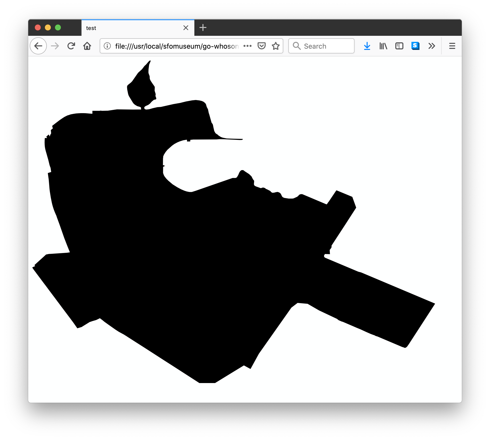

# go-whosonfirst-data

## Important

Work in progress. This package might be renamed.

## Tools

To build binary versions of these tools run the `cli` Makefile target. For example:

```
> make cli
go build -mod vendor -o bin/emit cmd/emit/main.go
```

## emit

```
> ./bin/emit -h
Usage of ./bin/emit:
  -format-json
    	Format JSON output for each record.
  -json
    	Emit a JSON list.
  -null
    	Emit to /dev/null
  -query value
    	One or more {PATH}={REGEXP} parameters for filtering records.
  -query-mode string
    	Specify how query filtering should be evaluated. Valid modes are: ALL, ANY (default "ALL")
  -stdout
    	Emit to STDOUT (default true)
  -uri string
    	A valid whosonfirst/go-whosonfirst-iterator URI. (default "directory:///")
```

For example:

```
$> bin/emit /usr/local/data/sfomuseum-data-media/data/ \

   -query 'properties.wof:belongs_to=\b102087579\b' \

   | wc -l

1122
```

### OEmbed

```
$> ./bin/emit \
	-format-json \
	-oembed \
	/usr/local/data/sfomuseum-data-media/data/

{
  "version": "1.0",
  "type": "photo",
  "width": 640,
  "height": 453,
  "title": "Installation view of \"Before the 21st Century: An Ode to Boats, Cars, Motorcycles, Planes, and Trains\"",
  "url": "https://millsfield.sfomuseum.org/media/137/702/095/5/1377020955_GkHONnz4lqxYWQ9me6mBLNmZdthfrTKv_z.jpg",
  "author_name": "SFO Museum",
  "author_url": "https://millsfield.sfomuseum.org/id/1377020955",
  "provider_name": "SFO Museum",
  "provider_url": "https://millsfield.sfomuseum.org/",
  "object_uri": "wof://id/1377020955"
}
{
  "version": "1.0",
  "type": "photo",
  "width": 640,
  "height": 380,
  "title": "Installation view of \"Airline Identity: Marks, Brands and Logos\"",
  "url": "https://millsfield.sfomuseum.org/media/137/704/368/7/1377043687_agKvxo3EzdgRyNUahkBXadodNcV0Vvgx_z.jpg",
  "author_name": "SFO Museum",
  "author_url": "https://millsfield.sfomuseum.org/id/1377043687",
  "provider_name": "SFO Museum",
  "provider_url": "https://millsfield.sfomuseum.org/",
  "object_uri": "wof://id/1377043687"
}
... and so on
```

...if not media information can be found then the code will create a base-64 encoded data URL for the feature's geometry.

```
$> ./bin/emit \
	-format-json \
	-oembed \
	-query 'properties.wof:concordances.iata:code=SFO' \
	/usr/local/data/sfomuseum-data-whosonfirst/data/

{
  "version": "1.0",
  "type": "photo",
  "width": 800,
  "height": 640,
  "title": "San Francisco International Airport",
  "url": "data:image/svg+xml;base64,PHN2ZyB3aWR0aD0iODAwLjAwMDAwMCIgaGVpZ2h0PSI2NDAuMDAwMDAwIiB2aWV3Qm94PSIwIDAgODAwIDY0MCIgeG1sbnM9Imh0dHA6Ly93d3cudzMub3JnLzIwMDAvc3ZnIj48cGF0aCBkPSJNNDguMDYzMTI4IDMwOC4yMDk3ODg ...(truncated for the sake of brevity)... IFoiLz48L3N2Zz4=",
  "author_name": "SFO Museum",
  "author_url": "https://millsfield.sfomuseum.org/id/102527513",
  "provider_name": "SFO Museum",
  "provider_url": "https://millsfield.sfomuseum.org/",
  "object_uri": "wof://id/102527513"
}
```

If you put the value of the `url` property in to an HTML `` you'd see this:



## See also

* https://github.com/whosonfirst/go-whosonfirst-iterator